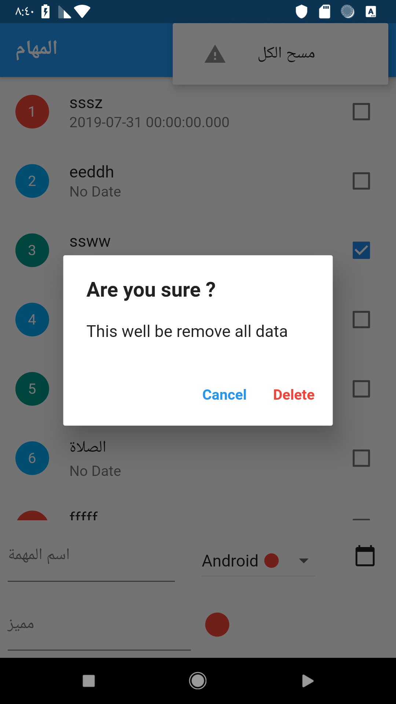
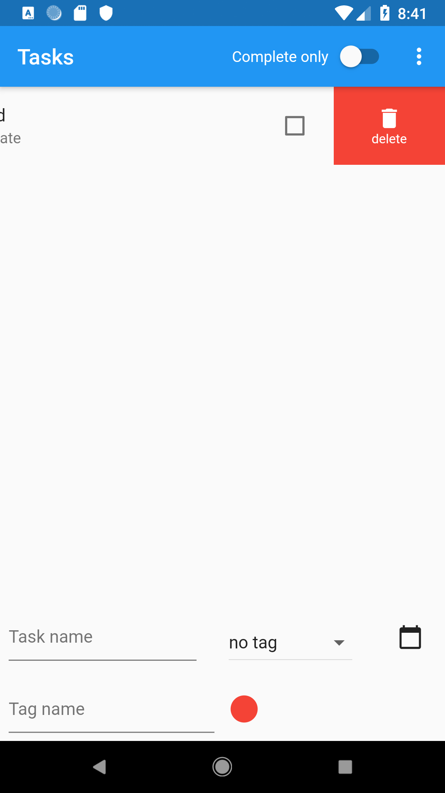
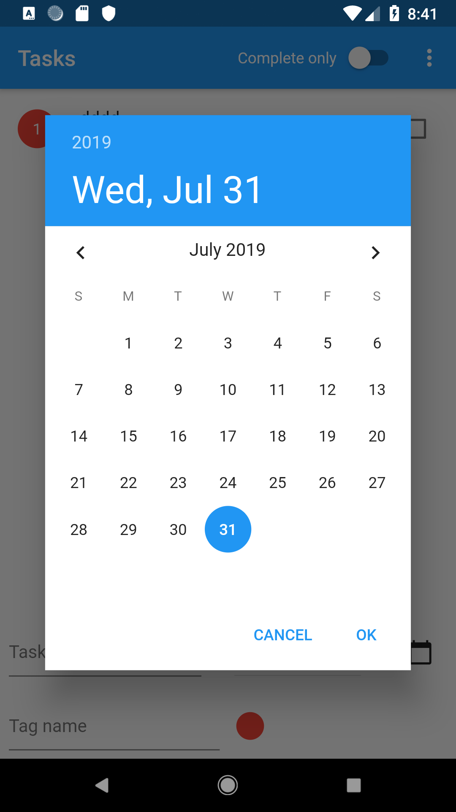
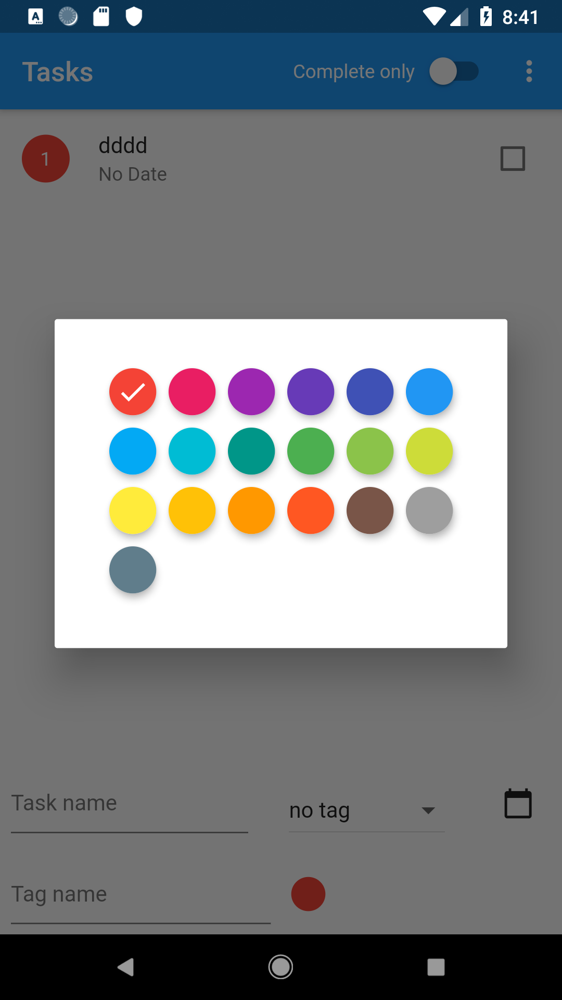
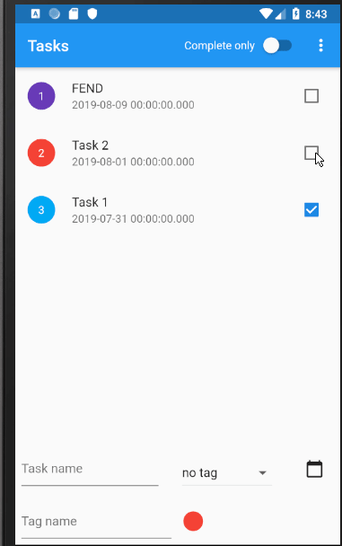

# Task flutter app 

 **برنامج ادارة المهام باستخدام مكتبة Moor
 جدول لاضافة المهام مرتبط بجدول المميز 
 استخدام Stream لرصد و متابعة الاضافة و التعديل و الحذف على قاعدة البيانات
 وكذلك استخدام مكتبة الاعتماديات Provider لربط الاعتماديات بين الكلاسات**
 
 *Work your tasks with use [Moor](https://moor.simonbinder.eu/) library to add and update and delete
 task, This app build two tables one for task and one tag, 
 using relation ship _oneToMany_ between those table 🦸 
 and using Stream to observe live change data*
 
## صور التطبيق 
  
  
  
  
  
   
 ## الاضافات 
-   استخدام الاعتماديات للربط بين الكلاسات   
-  استخدام السحب للايمن للاحذف و العكس لقراءة المميز للعنصر 
- اضافة زر Switch لفرز الهمام المكتملة عن الغير مكتملة  
-  صفحة تبيه عند حذف كامل الجدول 
-  صفحة تبيه عند محاولة حذف من جدول فارغ 
-  صفحة تنبيه عند ترك المستخدم لحقل المميز فارغ 
-  صفحة اختيار الوان خاصة بالمميز 
-  إظهار صورة عندما لا يوجد عمليات - مهام مكتملة 
-  دعم اللغة العربية 
-    اضافة تاريخ لكل مهمة
  
## Features 
- Use Provider to classes 💪
- Using slidable library,When pull to ⬅ delete row and when pull to ➡ read tag name 🍤
- Switch button to read tasks completed,then give your self some reward 🍨
- Notify user when delete all tasks or there not any task ⚠ ⚠
- Notify user when leave tag name empty ⚠
- Tag name picker color 
- support arabic language 
- Add Date of each task 📅 

  
  
  
  